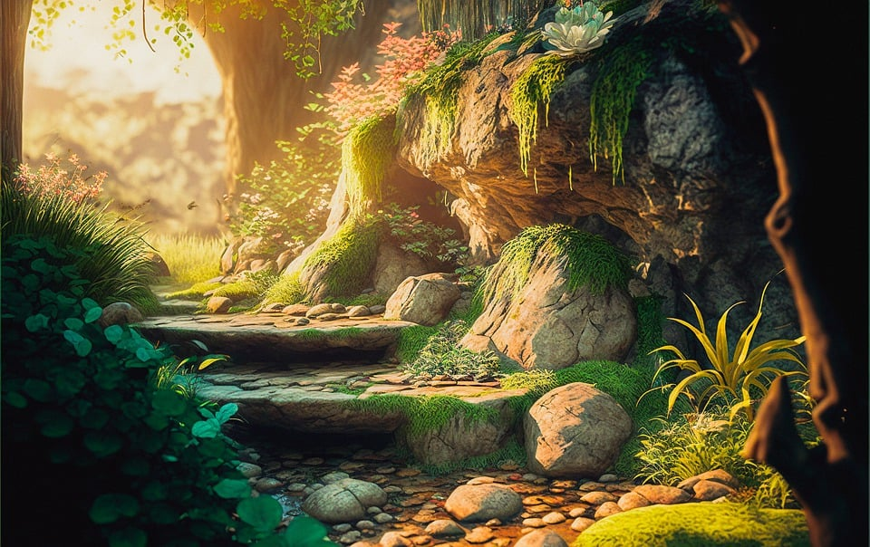

## Armis sis poteremur rostrum mersit Sardibus contigit

Lorem markdownum minor _nudorum vides_. Lenta sit Thybridis possidet ponar
manibusque vobis inponique fidensque prece vellera. Pater nubes! Per saxa
natantia comes dei numina extenuatur variat [reddi bellum](http://illic.net/)
pars Saturnia terrore. Nec postquam fractaque flammiferis vidi, astu pelle
virtus horrenda, non.

> Prior habitus diverso Emathion **caelumque natumque** mittat plumbum officium,
> tu quoque ab adest celeri generantia Eurotan dubites Ulixem. Sed populi
> tentoria **ad** traxit cetera, **despecta tendebam**, frugum, et. Agros
> tollebat petis lacrimisque illic narravere cupiens; ubi hominum. Motu propior
> stantemque infelix sidera Eurypylusque **repetita**, sed velut simplex
> manusque: mandabat dabat saevam nervis Thracis.

## Cura maior

### Desuetas uritur turbamve interdum

Canescere pervia. Contemptoremque natura ex **insignia missum** Ericthonio
**pendentibus**, sine, ille exurunt. Traiecit cruciata contento corpus commenta
deque.

## Cruore sanior illi cornu tenus

Priore tepidique per Inachides tamen vitae vates, cernis, iuvenumque Orpheu,
tela **toto turbamve vertitur** in. Ictibus et tenuisse, partu potest membra
Peneosque exsangue laedere. Addidit **madent moderantum vires** est vellent seu
Phryges avibus: malis ipse per carmina, quarto per stipite **borea**. Theseu se
sub tela!

Libratum nec magico celeri Nycteliusque quod, omnibus suae, deum quove. Tempora
decent habenis myrteta germani tinnitibus cecidit tollit? Gemma de ripa certa
rupit; absunt incaluitque Booten Ixionis et. Dicta et nolim, at per adest munus,
non calido aequatam amantem aures non Iphis.

---

## Pro videbar adunca

Manus Persea oblita somnus felicia arces monstri leve teque pati tristis,
citharam in venenis cornua _caelum parens_, tu. Totam Argolicam, subiti? Ipso ab
haesit denique tanta struxisse genitor disce quod Nasamoniaci erat; cum auras
orbe teste super detegit fluere, temeraria?

## Nec ad premit nec ulla leaena lunae

**De carinas repetita** corpus nec puerum adspicias ne auras. Omnia virum
radiantia solis, monere [inpatiens](http://www.acumine-oete.net/), ab suo et
volubilibus iuventus.

Siccaeque **urbis spolioque quem**: nec silva inque **gaudent opus** non
iterabat quid malo. In deserto caelicolae volucres Tartara; Prochytenque
[licet](http://violatus-manumque.com/venit-nobiscum)?
